## 6th string shapes:

<table>
  <tr>
    <td>Major</td>
	<td>Major 7</td>
	<td>Dominant 7</td>
	  <td>Dominant 9</td>
	<td>Dominant 13
	</tr>
	<tr>
    <td></td>
    <td>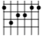
	<td>
	<td>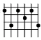
	<td>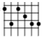
</td>
  </tr>
</table>

<table>
  <tr>
    <td>Minor</td>
	<td>Minor 7</td>
	</tr>
	<tr>
    <td>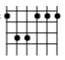
	<td>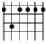
</td>
  </tr>
</table>

<table>
  <tr>
    <td>Diminished</td>
	</tr>
	<tr>
	<td>
</td>
  </tr>
</table>

 

## 5th String shapes:

<table>
  <tr>
    <td>Major</td>
	<td>Major 7</td>
	<td>Dominant 7</td>
	</tr>
	<tr>
    <td>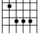</td>
    <td>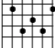
	<td>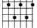
</td>
  </tr>
</table>

<table>
  <tr>
    <td>Minor</td>
	<td>Minor 7</td>
	</tr>
	<tr>
    <td>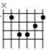
	<td>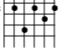
</td>
  </tr>
</table>

<table>
  <tr>
    <td>Diminished</td>
	<td>Half Diminished (m7♭5)
	</tr>
	<tr>
	<td>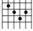
	<td>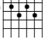
</td>
  </tr>
</table>

 

## Inversions
 

### Major

 

### Minor

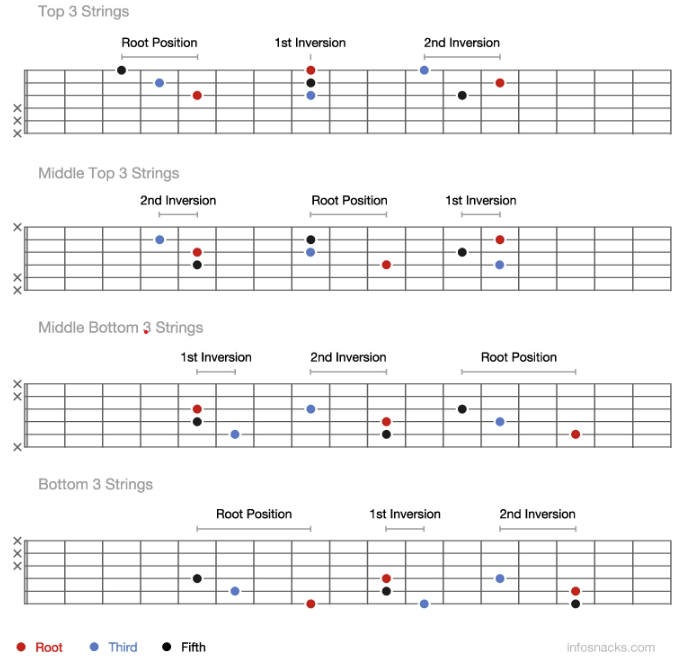	w	